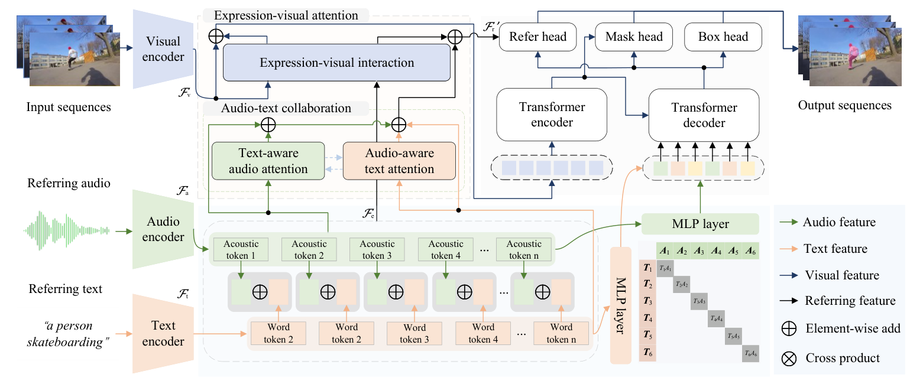

### 
 EPCFormer: Expression Prompt Collaboration Transformer for Universal Referring Video Object Segmentation
 

  Jiajun&nbsp;Chen</a> <b>&middot;</b>
  Jiacheng&nbsp;Lin</a> <b>&middot;</b>
  Zhiqiang&nbsp;Xiao</a> <b>&middot;</b>
  Haolong&nbsp;Fu</a> <b>&middot;</b>
  Ke&nbsp;Nai</a> <b>&middot;</b>
  <a href="https://www.researchgate.net/profile/Kailun-Yang" target="_blank">Kailun&nbsp;Yang</a> <b>&middot;</b>
  Zhiyong&nbsp;Li</a>
     
  <a href="" target="_blank">Paper</a>

 

Code will be released soon. 

 

### Update
- 2023.08.08 Init repository.

### Abstract
Audio-guided Video Object Segmentation (A-VOS) and Referring Video Object Segmentation (R-VOS) are two highly-related tasks, which both aim to segment specific objects from video sequences according to user-provided expression prompts. However, due to the challenges in modeling representations for different modalities, contemporary methods struggle to strike a balance between interaction flexibility and high-precision localization and segmentation. In this paper, we address this problem from two perspectives: the alignment representation of audio and text and the deep interaction among audio, text, and visual features. First, we propose a universal architecture, the Expression Prompt Collaboration Transformer, herein EPCFormer. Next, we propose an Expression Alignment (EA) mechanism for audio and text expressions. By introducing contrastive learning for audio and text expressions, the proposed EPCFormer realizes comprehension of the semantic equivalence between audio and text expressions denoting the same objects. Then, to facilitate deep interactions among audio, text, and video features, we introduce an Expression-Visual Attention (EVA) mechanism. The knowledge of video object segmentation in terms of the expression prompts can seamlessly transfer between the two tasks by deeply exploring complementary cues between text and audio. Experiments on well-recognized benchmarks demonstrate that our universal EPCFormer attains state-of-the-art results on both tasks.
